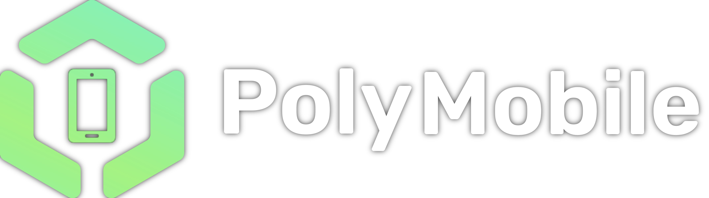

# PolyMobile 2.0

[](https://opensource.org/licenses/MPL-2.0)
[](https://godotengine.org/)
[](https://dotnet.microsoft.com/)

Polytoria is a 3D multiplayer gaming platform built on top of the [Godot Engine](https://godotengine.org/). It provides a set of tools for creating your multiplayer games, with server-client architecture, synchronized state replication and scripting powered by [Luau](https://luau.org/). Worlds can be published to [polytoria.com](http://polytoria.com/), which is accessible from Windows, macOS, Linux, and now **Android/Mobile**!

---

## Android Port

This thing brings the entire Polytoria multiplayer experience to mobile screens.

### Key Mobile Features

1. Connection to original Polytoria API, that allows you to play with other players!
2. *almost* fully working mobile UI and home screen!
3. bugs, a lot of bugs. 

### Compilation & Exporting to Android
Ensure you have the .NET SDK and Godot Android export templates installed.

1. **Restore dependencies and build the C# solution:**
   ```bash
   dotnet build Polytoria.sln
   ```
2. **Export the APK using Godot CLI:**
   ```bash
   # Debug APK
   godot --headless --export-debug "Android" Polytoria/Polytoria.apk

   # Release APK
   godot --headless --export-release "Android" Polytoria/Polytoria.apk
   ```

---

## Getting the Software

You can head to [polytoria.com](https://polytoria.com/) to register your account. The download button will be available in the [worlds](https://polytoria.com/places) page.

To launch the creator software, head to [polytoria.com/create](https://polytoria.com/create/) and click "Launch Creator" (not working on mobile as well...)

## Contributing

Contributing guides are currently a work in progress.

Meanwhile, you can join the [Polytoria Contributors](https://discord.gg/HUgEE9FhSU) Discord server if you have any questions!

## License

Unless otherwise noted:
- Source code is licensed under Mozilla Public License Version 2.0. Please check [LICENSE](/LICENSE) for more info.
- Brand assets, logos, names, and trademarks are not licensed for reuse.
- Third-party assets and native binaries are governed by their own licenses. Please refer to the respective repositories and documentation for more information.

## Contributors

<a href="https://github.com/narezany/PolyMobile/graphs/contributors">
  
</a>

Made with [contrib.rocks](https://contrib.rocks).
